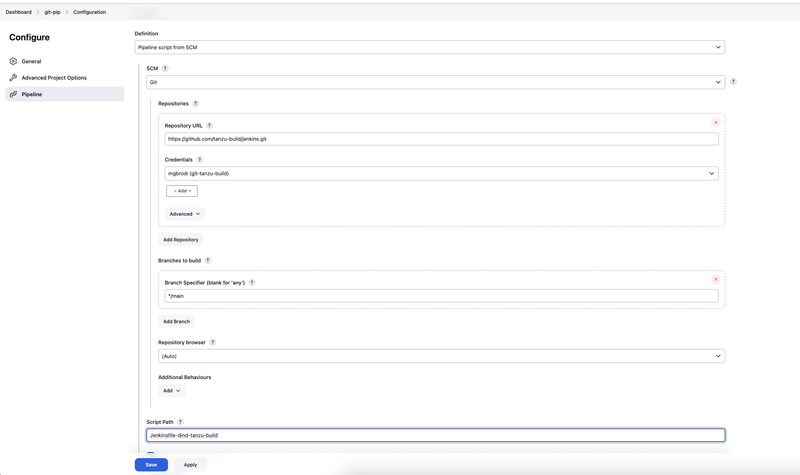

# `tanzu build` & `tanzu deploy` with Jenkins on k8s 

This repository contains:
- a Docker file to build a dind container with `tanzu cli`
- a jenkins pipeline that use `tanzu cli` to build and deploy artifacts.

Assumption:
Jenkins should be installed and running in`jenkins` namespace and:
- is configured to access the images referenced in `Jenkinsfile-dind-tanzu-build`
- Pipeline, Kubernetes and Credentials plugins are installed and configured
- Credentials are configured to access Registries and Repositories (see later) 

## How to use (`tanzu build`)

1. build the images for the agent to run `tanzu cli`:
- if using self signed certificates for your registry add the Custom CA to the stack of your builder 
- build and push the image for the DIND with `tanzu cli`, change <YOUR REGISTRY> to match the registry to push the image to:
```
cd Image
# targeting an AMD platform 
export DOCKER_DEFAULT_PLATFORM=linux/amd64

docker build . -t <YOUR REGISTRY>/docker:dind-tanzu-build
docker push <YOUR REGISTRY>/docker:dind-tanzu-build
cd ..
```
2. create a volume claim to cache layers bewteen runs. Edit k8s/pvc.yaml and change <YOUR STORAGE CLASS> with the name of the storage class, then connect to your k8s cluster running Jenkins and create the pvc:
 ```
cd k8s
kubectl apply -f pvc.yaml
cd ..
```
3. create a pipeline with the following parameters (GIT_CREDENTIALS_ID contains a token)


4. Edit `Jenkinsfile-dind-tanzu-build`:
- change <YOUR REGISTRY> to your registry 
- change default values to your own defaults

5. configure an SCM pipeline




## NOTE: `tanzu deploy` is work in progress and coming soon!!!
## TODO:
- Add instructions for Jenkins installation
- Add instructions to add Custom CA to builder
