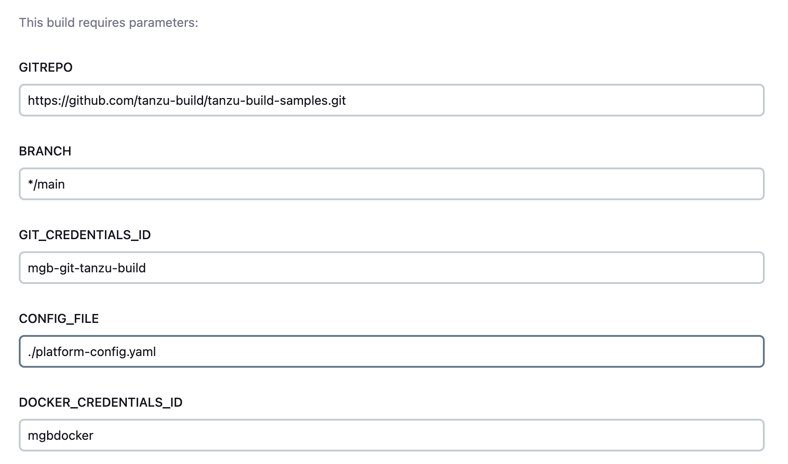
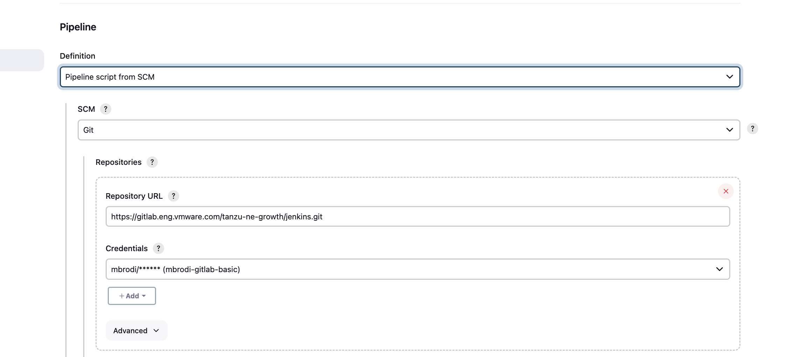
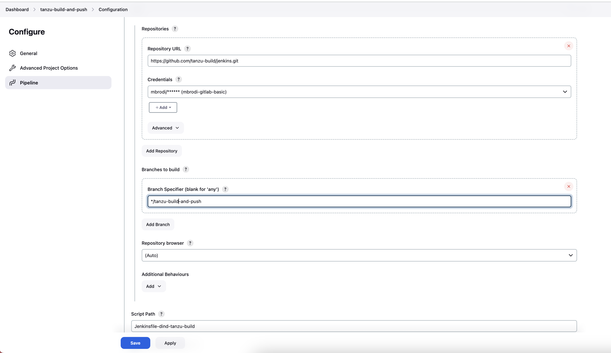

## How to use (`tanzu build`)

1. create a pipeline with the following parameters (GIT_CREDENTIALS_ID contains a token)

2. Edit `Jenkinsfile-dind-tanzu-build`:
- change <YOUR REGISTRY> to match the registry that contains the doker+tanzu-cli image built at step 1.
- change default values to match your own defaults

3. configure an SCM pipeline

