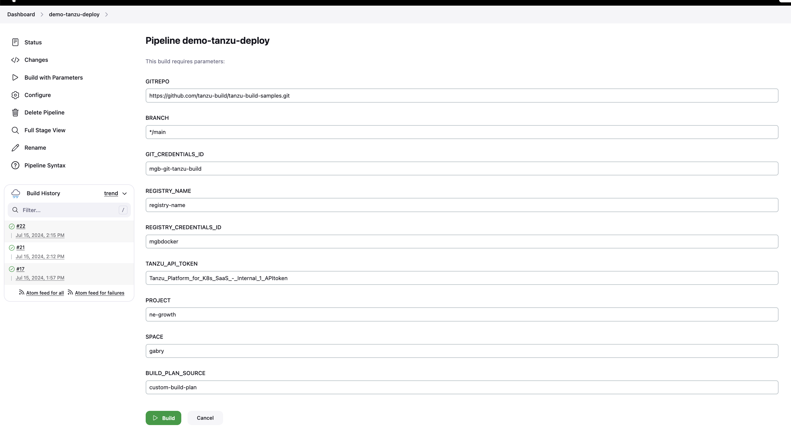
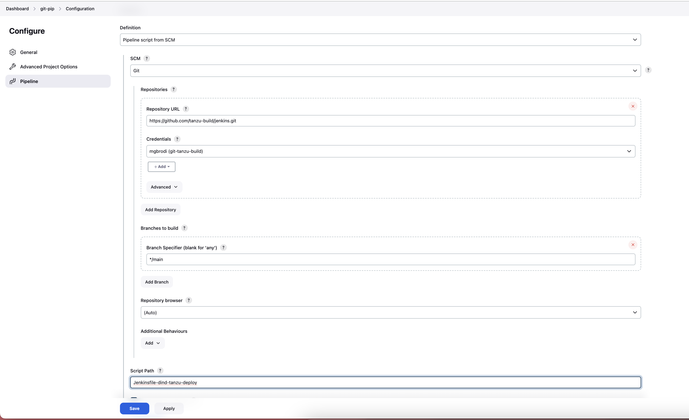

## How to use (`tanzu build`)

1. Create a pipeline with the following parameters (GIT_CREDENTIALS_ID contains a token)

2. Edit `Jenkinsfile-dind-tanzu-deploy`:
  If running on k8s
    - change <YOUR REGISTRY> to match the registry that contains the doker+tanzu-cli image built at step 1.
  Otherwise remove the `kubernetes` section

- change default values to match your own defaults

3. configure an SCM pipeline

4. Follow instruction to obtain API Token and configure your space in TPk8s following ## Prerequisites in https://github.com/cpage-pivotal/tanzu-deploy-action
